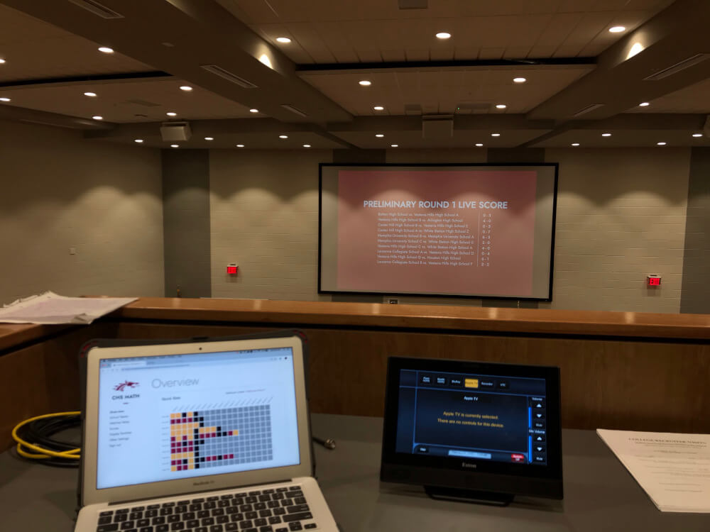
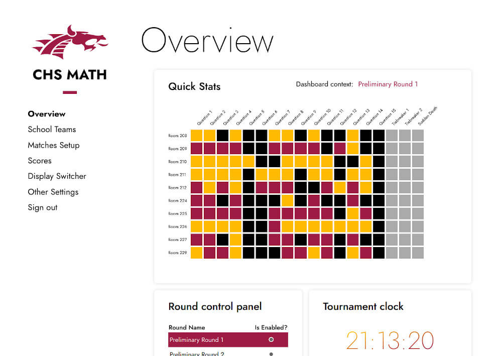
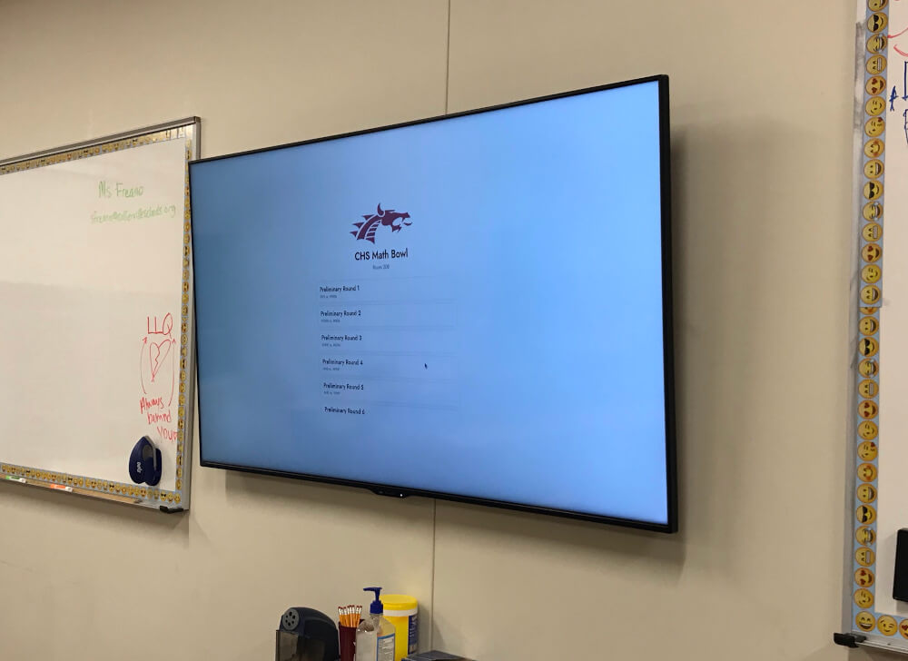
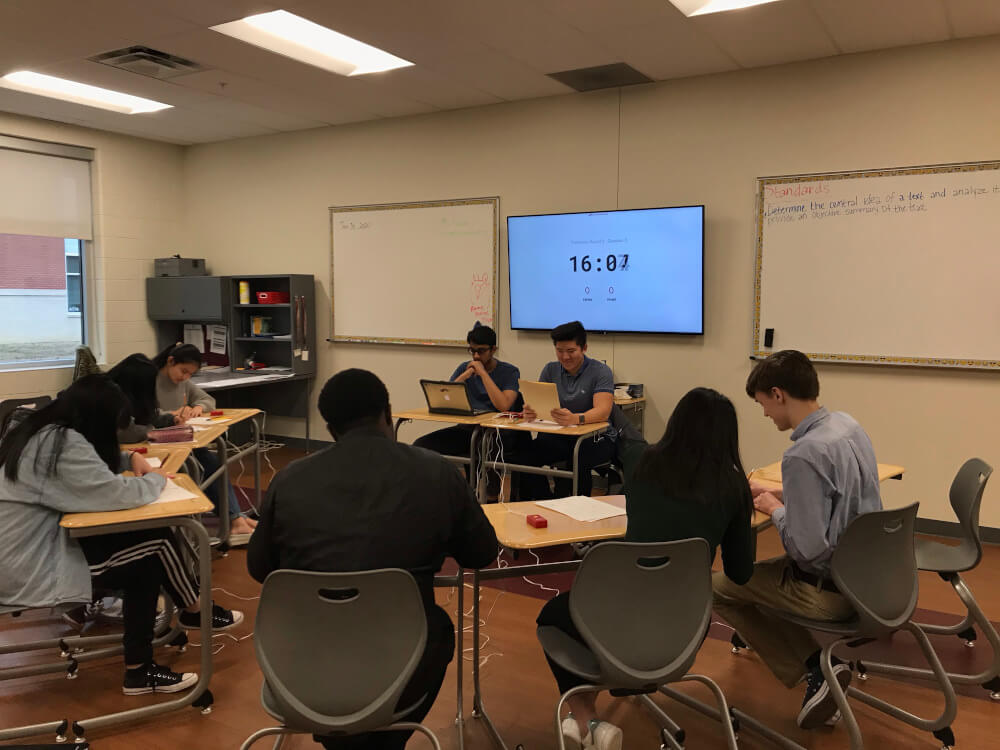
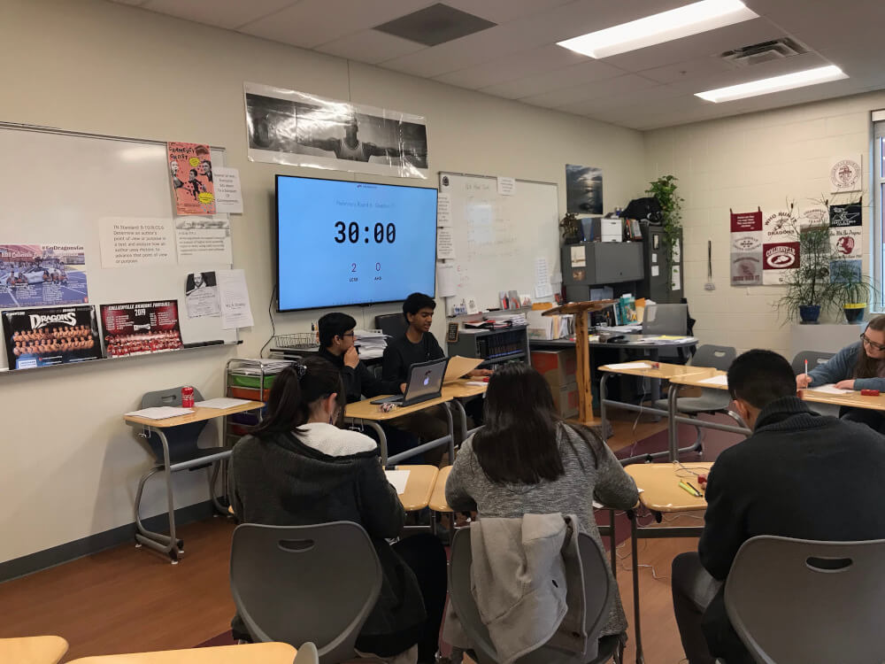
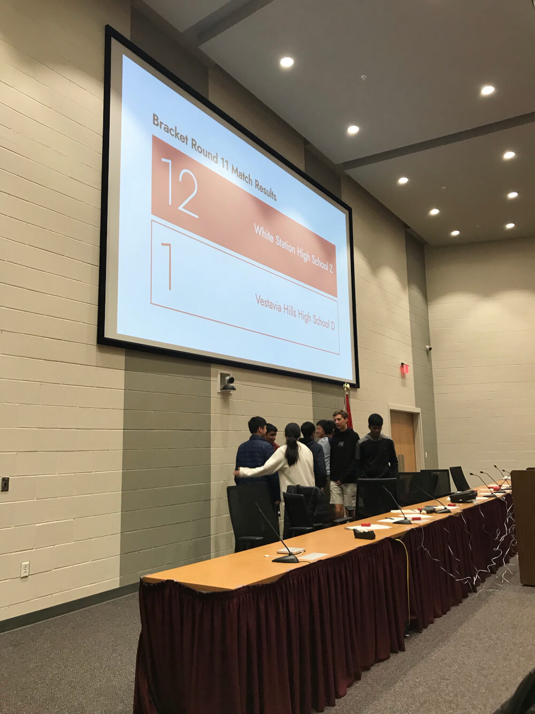

# Tournament Manager for CHS Math Bowl
Firebase + HTML/CSS app. 3 major parts: auditorium display, room displays, admin console.

Admin console can manipulate schedule, delete/change/add scores, toggle auditorium display between next round's schedule / live scores for current round / team rankings.

Rank calculations happen automatically as scores come in.

Each room has a live-updating list of matches on its schedule, which volunteers can click on and run. After each round, a final score is displayed on the TV, and the score is also logged in firebase, which triggers updates on admin console and auditorium display.

---

The auditorium display showing live scores from the current round. In the foreground, the admin console shows progress of each room (each row of squares is a room, each column is a given question, and each square indicates which team got the question correct).

---

A screenshot of the disputes panel on the admin console, which shows results from every match. Admin console can change, delete, or add scores synthetically (this feature is included to handle any potential disputes on problem correctness that may come up).

---

A clearer screenshot of the overview panel on the admin console from the first image.

---

The TV in one of the match rooms, showing the queue of matches the room needed to run on its schedule. Each room hosted matches during each preliminary round, which is why the list is quite long.

---

Rounds in action! The two people sitting up front are volunteers running the tournament, and they interact with the tournament manager software by starting/stopping the timer and adding points to whichever team gets the question right.

---

White Station High School with a crushing performance over Vestavia in the semifinal round. After each round, a final score is displayed for teams to see.

---

Admin console scheduling page. Each card represents a match, and every maroon text is a dropdown where the admin can pick what teams are in the match and which room the match gets assigned to. The green dot indicates the match is not started. Yellow meant it was in progress, and blue meant it was completed.

---

Screenshot of timer app that ran in each room.
